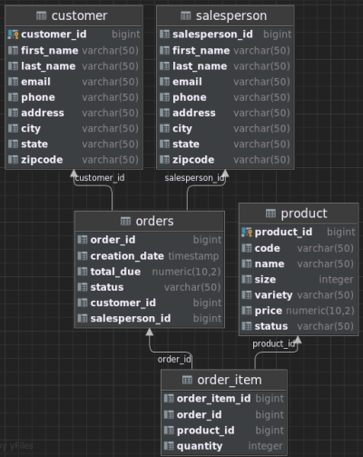

# Introduction
This application uses JDBC (Java Database Connectivity) to perform CRUD (Create, Read, Update, Delete) operations against
a PostgresSQL RDBMS, using common DB patterns including `DTO` and `DAO`. This application was tested using the 
PSQL JDBC Driver and successfully connects to the dockerized PSQL database. 
- **Development Method**: Agile _(Scrum)_
- **Technologies Used**:
  _Docker, Docker Hub, PostGreSQL, Git,
  Github, IntelliJ IDE, VNC, GCP, Java 8_

# Implementation
## ER Diagram 
Below is the schema of the database including tables, table/row names, data types and relations.

## Design Patterns
In this project `DAO/DTO` and `Repository` design patterns are used. 

- `DAO/DTO` design patterns are used to separate (abstract) CRUD operations upon the 
database. In this project CustomerDAO.java is decoupled from `JDBCEntryPoint.java`. `CustomerDAO.java`
hides low-level details of database CRUD operations from the entire application. Users only manipulate
database entries from the `JDBCEntryPoint.java` class. This adds a level of 
security and lessens overall project complexity. 

- The `Repository` design pattern has two purposes. Like the `DAO/DTO` patterns the Repository design 
pattern abstracts low-level implementation of code. `DataTransferObject.java` declares `getId()` allowing 
users of this program access to customer information without underlying software implementation. Second the 
`Repository` pattern focuses on single-table access per class. This project follows the `Repository` pattern 
as only `Customer.java` manipulates the table `Customer` in the database. 

# Testing
- Testing was done accessing a dockerized PSQL database then inserting ddl commands to set up
database and tables. IntelliJ's database viewer tool to was used verifing the architecture after creation 
of database and tables. Used `JDBCEntryPoint.java` where all (CRUD) operations are tested in a single 
process and database entries are checked by using the PSQL client.