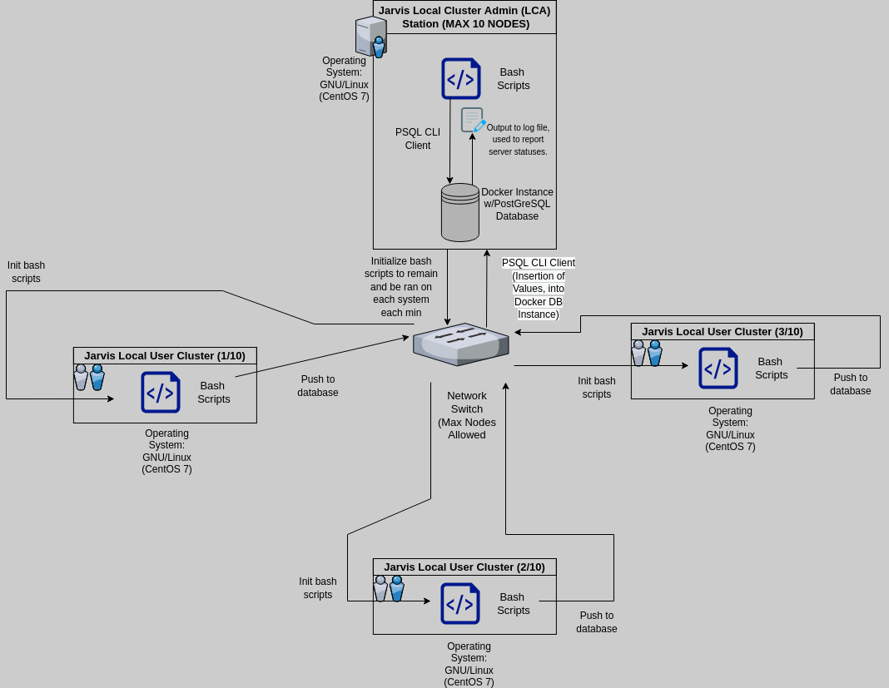

<<<<<<< HEAD
=======
<<<<<<< HEAD
>>>>>>> 90e0b7a2d07a562113ce9030a4ba300359d2b192
# Introduction
This app is designed for the Jarvis Linux Cluster Administration (LCA) team managing a Linux cluster of servers running the GNU/Linux distribution CentOS 7. These servers are connected through a switch and communicate through internal IPv4 addresses to monitor usage statistics. Created agents collect usage statistics of each individual computer every minute. After, agents insert values to a local PostgreSQL database. This program is made so the Jarvis (LCA) team can produce reports, to determine addition or removal of future servers.
- **Development Method**: Agile _(Scrum)_
- **Technologies Used**:
  _Docker, PostgreSQL, Git, Github, IntelliJ IDE, PSQL CLI, VNC, Bash, Google Cloud Platform_
# Quick Start
**Overview**:
1. Create and run PSQL instance using `psql_docker.sh` to use Docker for PostgreSQL.
2. Connect to PSQL instance, create and connect to new database in PostgreSQL.
3. Create tables using file `ddl.sql`.
4. Insert hardware spec into the DB using `host_info.sh`.
5. Insert hardware usage into the DB using `host_usage.sh`.
6. Setup crontab to use for running script `host_usage.sh` per minute.

**Code**:
```bash,sql
# Name: Hunain Khalid
# Date: Dec,12,2021

# cmds below assumed to be run in directory /linux_sql/.../...
# remember once assigned a certain username and password one
# MUST use the exact same user/password as during creation.

#1: Create / run docker + database 
./scripts/psql_docker.sh create [db_username] [db_password]
./scripts/psql_docker.sh start

#2: Create new database

#2.1: Connect to psql instance, prompt will ask for pass
#(Personal Use Case): psql -h localhost -U postgres -W
psql -h [psql_host] -U [db_username] -W

#2.2: Create db, if doesn't exist. Then switch.
#(Personal Use Case): CREATE DATABASE host_agent;
#                   : \c host_agent;         
CREATE DATABASE [db_name];
\c [db_name];

#3: Create database called host_agent, filled with tables from ddl.sql
#(Personal Use Case): psql -h localhost -U postgres -d host_agent -f sql/ddl.sql
psql -h [psql_host] -U [db_username] -d [db_name] -f sql/ddl.sql

#4: Insert hostinfo data into db, table host_info
./scripts/host_info.sh [psql_host] [psql_port] [db_name] [db_username] [db_password]

#5: Insert hostusage data into db, table host_usage
./scripts/host_usage.sh [psql_host] [psql_port] [db_name] [db_username] [db_password]

#6: Setup crontab
crontab -e
#6.1: After, press 'i' on the keyboard and INSERT, log file can be of named your choice, default host_usage for convienence 
* * * * * bash /home/[full_pathname_to_folder]/linux_sql/scripts/host_usage.sh [psql_host] [psql_port] [db_name] [db_username] [db_password] &> /tmp/host_usage.log

#6.2: After, press 'ESC' on the keyboard and type :wq, this will save your file and exit from the text editor.
```
# Implementation
## Architecture


# Scripts
> **psql_docker.sh**
- psql_docker.sh allows a user to create, start or stop a Docker container. Starting or stopping containers are done respectively with commands "start" or "stop". "Create" creates a Docker container with a PostgreSQL instance inside as well.

Steps
1. Attain command line arguments (`$cmd, $db_username, $db_password`)
2. See if Docker is running on the local machine, run if Docker processes stopped.
3. If "create" selected, check for exactly 3 arguments and if the Docker container already exists. Continue creation if checks passed, else exit 1.
4. If "start" selected, the container has to have been created already, after a successful start, output confirmation on console will be generated. If any of the above fail exit 1.
5. If "stop" selected, the container must have  been running / must have existed. If this fails exit 1 else, exit 0.
6. Anything else will generate an output "Illegal Command" and the script exits with code 1.

Usage

    ./scripts/psql_docker.sh start|stop|create [db_username][db_password]
 ___
>**host_info.sh**
- host_info.sh takes 5 arguments, assuming correct values supplied will insert values once per host machine.  On success will output host info data (id, hostname, cpu_number, cpu_architecture, cpu_model, cpu_mhz, L2_cache, total_mem, timestamp) into PSQL database, once.

Steps
1. Attain command line arguments (`$psql_host, $psql_port, $db_name, $psql_user, $psql_password`)
2. After insert data using the PSQL client.
3. Anything else will generate an "Illegal output" and the script exits with code 1.

Usage

    ./scripts/host_info.sh [psql_host] [psql_port] [db_name] [db_username] [db_password]
___
>**host_usage.sh**
- host_usage.sh takes 5 arguments, assuming correct values supplied will insert values once per host machine. On success will output host usage data (timestamp, host_id, memory_free, cpu_idle, cpu_kernel, disk_io, disk_available) into PSQL database, once.

Steps
1. Attain command line arguments (`$psql_host, $psql_port, $db_name, $psql_user, $psql_password`)
2. After insert data using the PSQL client.
3. Anything else will generate an "Illegal output" and the script exits with code 1.

Usage

    ./scripts/host_usage.sh [psql_host] [psql_port] [db_name] [db_username] [db_password]
___
>**Crontab**
- Crontab automates scripts. Use this program to automate the above script `host_usage.sh` every minute and insert usage statistics to PSQL database instance.

Steps
1. Get working directory (type pwd on cmd line)
2. Type crontab -e in terminal (allows editing)
3. Edit and save crontab

Usage
After typing crontab -e, press 'i' on the keyboard and INSERT, code snippet below. After press the keys ("ESC") then type ":wq" and press ENTER, this will save and quit from editor.

    * * * * * bash /home/[full_pathname_to_folder]/linux_sql/scripts/host_usage.sh [psql_host] [psql_port] [db_name] [db_username] [db_password] &> /tmp/host_usage.log
___
>**ddl.sql**
- Simple SQL file to create SQL tables if they do not already exist in the PostgreSQL database.

Usage

    psql -h [psql_host] -U [db_username] -d [db_name] -f sql/ddl.sql
___

>**queries.sql**
- SQL file to return 3 queries, organizing data for the LCA team's report.

Queries
1. This query will group [hosts] by: cpu#, id and total memory. The hosts with the highest total memory will appear first, then the second highest and so fourth. (Order by descending order). Taken from "host_info" table.

2. This query takes values that appear in both host_usage and host_info table and returns the average memory usage for each individual host. Grouped by their timestamp, host_id and hostname. Ordered by host_id then timestamp.

3. This query checks if crontab script fails. This is done by querying to find out if within a 5 min interval there are less than three rows of data for a specific host id, from the host_usage table. Group by host_id and timestamp, order by timestamp.


## Database Modeling
Table Schemas:
- `host_info`

| Variables      | Type | Description     |
| :---        |    :----:   |         :--- |
| `id`      | SERIAL, NOT NULL | Primary Key, Non-repeatable, an id is given to each host.  |
| `hostname`   | VARCHAR, NOT NULL | Contains hostname in full format     |
| `cpu_number`   | INT, NOT NULL | Contains numbers of CPU cores|
| `cpu_architecture`   | VARCHAR, NOT NULL | Contains Cpu architecture      |
| `cpu_model`   | VARCHAR, NOT NULL| Contains cpu model name       |
| `cpu_mhz`   | VARCHAR, NOT NULL    | Contains current mhz usage in kb       |
| `L2_cache`   | INT, NOT NULL      | Contains information about a computers L2 cache      |
| `total_mem`   | INT, NOT NULL        | Contains information about a computers total memory      |
| `timestamp`   | TIMESTAMP, NOT NULL        | Contains information about computer usage during a period of time in timestamp format      |


- `host_usage`


| Variables      | Type | Description     |
| :---        |    :---:   |         :--- |
| `timestamp`      | TIMESTAMP, NOT NULL | Contains information about computer usage during a period of time in timestamp format    |
| `host_id`   | SERIAL, NOT NULL, REFERENCES host_info(id) | FOREIGN KEY, will reference id in table host_info and store it here in host_id
| `memory_free`   | INT, NOT NULL | Contains amount of memory free in KB      |
| `cpu_idle`   | INT, NOT NULL    | Contains current cpu usage while idle       |
| `cpu_kernel`   | INT, NOT NULL| Contains information about a computers time processing kernel programs    |
| `disk_io`   | INT, NOT NULL| Contains information about a computers total memory      |
| `disk_available`   | INT, NOT NULL      | Contains information about the amount of space available on disk, in KB     |

# Testing
Bash scripts and SQL queries that were tested manually through the command-line interface and using DBeaver, a real-time GUI interface for databases. The testing proved successful when DBeaver showed multiple inserted rows after leaving the host machine on for an hour, upon refresh. Also entries were created only whilst the Docker container is running.

# Deployment
This app is deployed to this very GitHub repository. A Docker image with PSQL was provisioned via DockerHub. A jarvis remote desktop running CentOS 7 was used for testing and deployment.

# Improvements
- More time implementing fail fast, fail safe methodology for all code.
- SQL query testing can be done more extensively.
<<<<<<< HEAD
- Better version tracking by pushing to GitHub on feature branches, early in development rather than later.
=======
- Better version tracking by pushing to GitHub on feature branches, early in development rather than later.
=======
>>>>>>> master
>>>>>>> 90e0b7a2d07a562113ce9030a4ba300359d2b192
